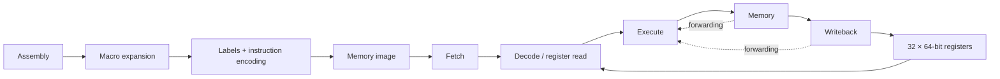

# Blinker — Custom 64-bit RISC Processor & Toolchain

**C · Verilog/SystemVerilog · Assembly · CMake · Bash**

Blinker connects assembly source to a custom 64-bit RISC processor, covering instruction encoding, pipeline control, operand forwarding, and memory access.

This is a **ported, privacy-sanitized version of a school project**, prepared for public portfolio review. The original processor and diagnostic benches are preserved apart from project-name changes. Missing toolchain components were reconstructed for this port. Personal identifiers, submission metadata, and the original Git history are excluded.

## Highlights

- **Five-stage processor:** fetch, decode, execute, memory, and writeback, with explicit pipeline registers and a 32-register, 64-bit register file.
- **Pipeline control:** operand forwarding from later stages, load-use hazard detection, and stall/flush logic.
- **Custom ISA:** fixed 32-bit instruction encodings for 64-bit arithmetic, logic, shifts, floating-point simulation, control flow, and memory transfers.
- **C assembler:** two-pass label resolution, parameterized/nested macros, instruction encoding, 64-bit constant expansion, and source-line error diagnostics.
- **CMake/Bash workflow:** assembler builds, assembly-to-memory-image generation, and optional Icarus Verilog simulation.
- **Dual-execution extension:** a standalone two-lane integer execution module with same-pair forwarding and conflicting-write rejection. It is not integrated into the preserved processor.

## Architecture



The default memory model contains 512 KiB. Execution begins at `0x2000`, instructions occupy four bytes, and 64-bit memory values use little-endian byte order. `r0` is writable; `r31` starts at the end of memory for stack access.

## Quick start

Prerequisites: a C11 compiler, CMake 3.16 or later, and Bash. Simulation additionally requires Icarus Verilog (`iverilog` and `vvp`); GTKWave is optional.

```bash
# Build the assembler only; this does not run simulations.
./scripts/build.sh

# Assemble an example into a byte-oriented memory image.
./build/blinker-as examples/arithmetic.asm -o build/arithmetic.hex

# Assemble all included examples.
cmake --build build --target examples
```

Alternatively, configure with `cmake -S . -B build` and build with `cmake --build build --target blinker-as`. `BUILD_DIR` overrides the scripts' default build directory.

## Assembly

```asm
.macro increment dst
    addi \dst, 1
.endm

li r1, 40
increment r1
increment r1
halt
```

Instructions encode `opcode[31:27] | rd[26:22] | rs[21:17] | rt[16:12] | literal[11:0]`. Mnemonics, registers, labels, and macros are case-sensitive; `;` and `#` start comments.

| Form | Example / behavior |
| --- | --- |
| Register arithmetic and logic | `add r3, r1, r2`; also `sub`, `mul`, `div`, `and`, `or`, `xor`, `not` |
| Immediate arithmetic and shifts | `addi r1, 1`; also `subi`, `shftr`, `shftl`, `shftri`, `shftli` |
| Register/constant moves | `mov r1, r2`; `movi r1, 42` replaces only the low 12 bits |
| 64-bit constant pseudo-instruction | `li r1, 0x123456789abcdef0` expands to 12 native instructions |
| Memory | `load r3, r1, 0`; `store r1, r2, 0` stores `r2` at the address in `r1` |
| Control flow | `br r1`, `brr r1`, `brrl label`, `brnz r1, r2`, `brgt r1, r2, r3`, `call r1`, `return`/`ret`, `halt` |
| Floating-point simulation | `addf`, `subf`, `mulf`, `divf` with three register operands |
| Labels, data, and no-op | `label:`, `.word value`, `.quad value`, `nop` |

Arithmetic immediates and memory offsets must fit signed 12 bits; `movi` accepts `0..4095`. `li` accepts a 64-bit value or label. `brrl label` resolves a signed displacement from the current instruction address. Calls/returns access `[r31-8]` without automatically adjusting `r31`.

Macros must be defined before invocation and support up to 16 nested expansion levels. Parameters use `\name`; macro labels are global, not automatically renamed. Expressions, linking, include directives, and automatic instruction scheduling are not implemented.

Hex output uses an `@00002000` address marker followed by individual bytes for `$readmemh`. `--format bin` emits raw little-endian bytes without address padding. `--base` changes the assembly base, but the processor still resets to `0x2000` unless modified separately.

Invalid operands, unknown opcodes, unresolved/duplicate labels, literal overflow, macro errors, and I/O failures produce source-line diagnostics and a nonzero exit status. These are assembler diagnostics, not a general hardware exception subsystem.

## Optional simulation

```bash
# Assemble, compile the loader, and simulate until halt or timeout.
./scripts/run.sh examples/arithmetic.asm

# Compile the diagnostic benches and loader without running them.
cmake --build build --target rtl

# Run an original diagnostic bench explicitly.
make br_tb

# Compile the standalone extension without changing the processor.
cmake --build build --target dual-execute
```

The loader writes `build/program.vcd` and prints registers at halt. `MAX_CYCLES` overrides the default 10,000-cycle limit. These commands are provided for exploration; they have not been validated during this port.

## Code tour and provenance

| File or directory | Scope |
| --- | --- |
| [`blinker.sv`](blinker.sv) | Preserved pipeline wiring, forwarding, hazard detection, and halt handling |
| [`instruction_decoder.sv`](instruction_decoder.sv) | Preserved opcode decoding and control generation |
| [`alfpu.sv`](alfpu.sv) | Preserved integer/FP operations, branch targets, and memory addressing |
| [`stage_registers.sv`](stage_registers.sv), [`fetch.sv`](fetch.sv), [`reg_file.sv`](reg_file.sv), [`memory.sv`](memory.sv) | Preserved stage state, fetch, register file, and memory |
| `br_tb.sv`, `brgt_tb.sv`, `call_tb.sv` | Preserved diagnostic benches; project references renamed |
| [`assembler/blinker-as.c`](assembler/blinker-as.c) | Reconstructed C assembler |
| [`extensions/dual_execute.sv`](extensions/dual_execute.sv) | Reconstructed two-lane integer execution extension |
| `examples/`, `sim/`, `scripts/`, CMake, Makefile | Reconstructed examples, simulation loader, and build/publication tooling |

Reconstructed components were added with AI assistance; they are not recovered original coursework. The processor's behavior was not redesigned during this naming and privacy port.

## Status and limitations

**Archival source port, not a validated release.** No builds, simulations, or tests were run during the port. The original pipeline has known risks around branch/flush timing, execute-stage PC alignment, and forwarding coverage. Floating-point operations use simulation-only real-number conversions, and the memory model lacks complete bounds/alignment traps. The inherited benches are diagnostic artifacts, not a comprehensive correctness suite.

The dual-execution module remains standalone. Integration would require wider fetch/decode, register-file ports, hazard management, and ordered writeback. Its existence does not establish a processor throughput improvement.

The original project résumé reports **90% higher performance than a single-cycle implementation while preserving architectural correctness across assembly programs**. The baseline, benchmark suite, timing assumptions, and raw results were unavailable, so this historical claim has **not been reproduced or independently verified in this port**.

## Publication and privacy

This repository is prepared for public recruiter review. Original private source archives and Git history are not included. Only sanitized project files belong in this repository; never add original submissions, personal identifiers, credentials, or private archives.

Run `python3 scripts/check-publication.py` before publishing changes. For an additional local check, pass `--identity-file` with a private text file containing one identifier per line; its contents are never printed or copied into the repository. The checker is a safeguard, not a guarantee that arbitrary future content is anonymous. Public GitHub ownership remains visible.

No open-source license is granted by this port; public visibility alone does not grant redistribution rights.
